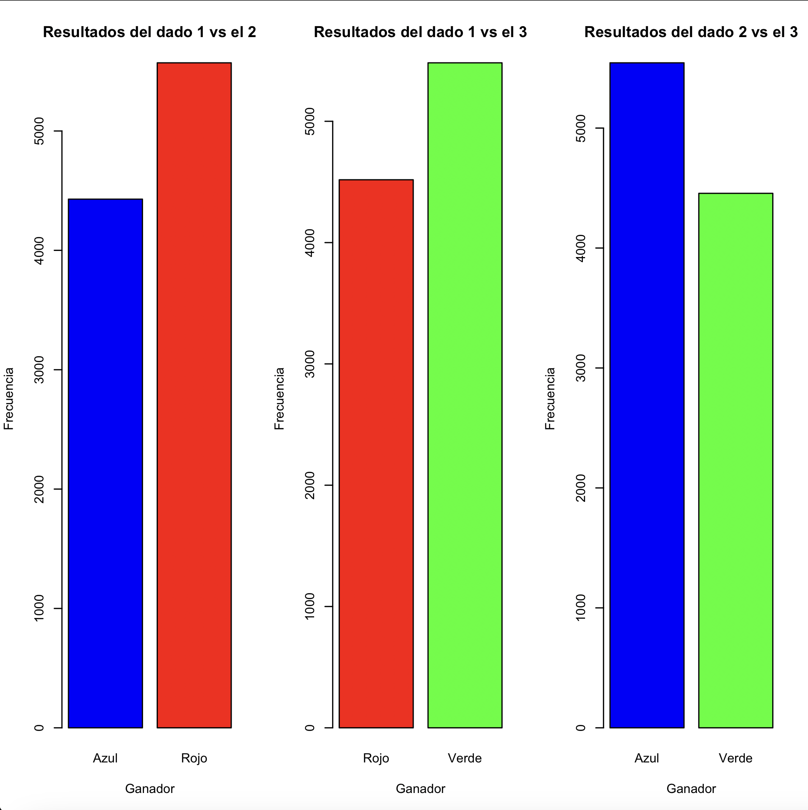
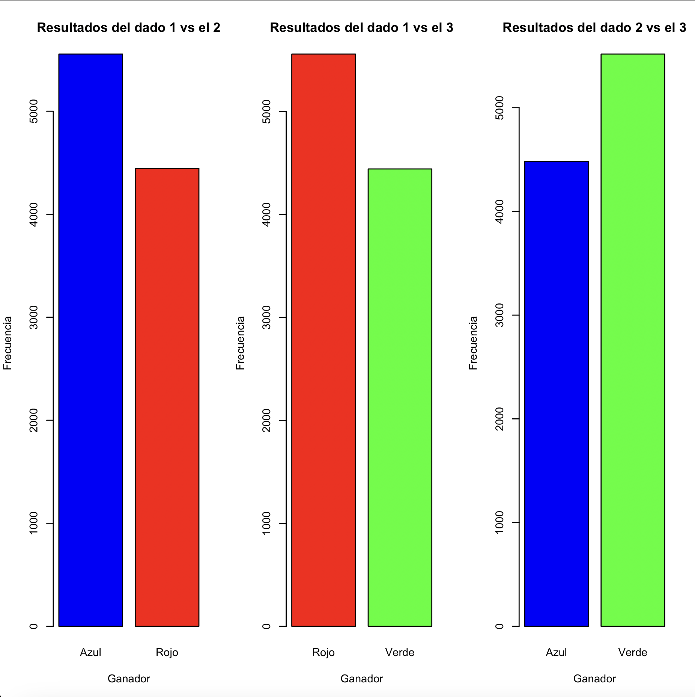
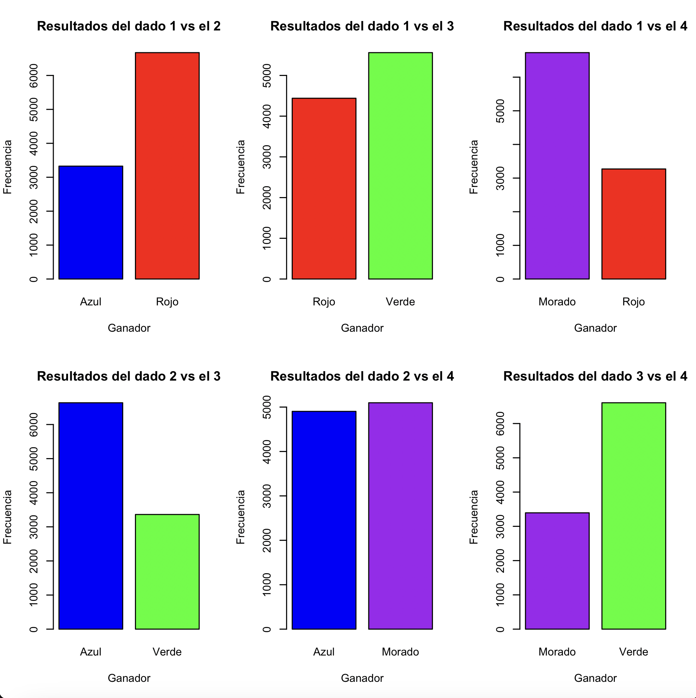
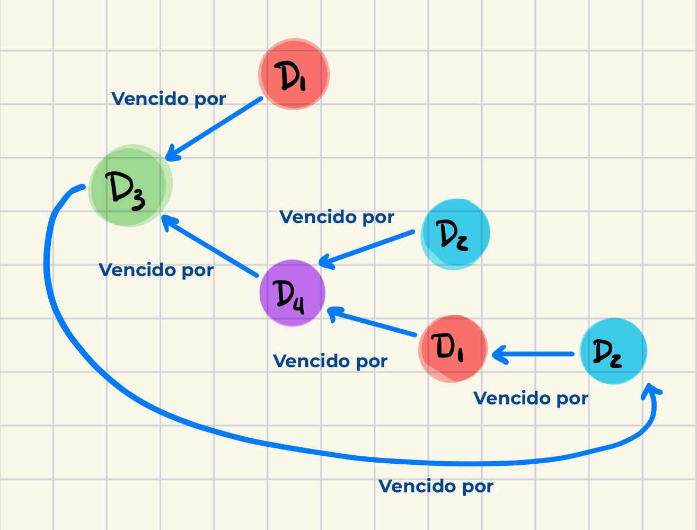

# IntransitiveDice
Analysis of the intransitivity property within the simulation of rolls of three groups of 6-sided dice using the statistical software R
---
# Dados intransitivos

# Introducción

Considérese un clásico juego de manos de “Piedra, Papel o Tijeras”. Como es comúnmente sabido, el gesto de “Piedra” alude al objeto real que dentro del juego vence al gesto de “Tijeras”. Así, el juego sigue una secuencia de triunfo (denotado como →) de un gesto sobre otro dictada por:

Piedra → Tijeras, Tijeras → Papel, Papel → Piedra

La secuencia anterior sigue una propiedad de relación “no transitiva” o “intransitiva” entre los elementos. Es decir, cada elemento del conjunto de gestos del juego se dice ser mejor o tener más poder sobre otro y éste a su vez posee la misma propiedad sobre otro elemento distinto a los anteriores, formando un ciclo. 

A continuación, se abordan 3 casos ejemplificando dicha propiedad aplicado a juego con dados. Se simulará por medio de un programa el tirar ciertos dados para posteriormente analizar la frecuencia con la que se obtiene cada elemento. El estudio se centrará en la relación de la frecuencia respecto a la propiedad de intransitividad.

# Objetivo

Analizar la propiedad de intransitividad dentro de la simulación de tiradas de tres grupos de dados de 6 caras utilizando el software estadístico R. 

# Planteamiento

Como definen João et al (2023), para la presente práctica, un dado de $n$ caras se refiere a un par $(A, α)$, donde A es un vector $(A_{1},…,A_{n})$, donde cada $A_{k}$ se refiere al número de cara $k$ y $α$ es una variable que toma valores aleatorios de 1 a $n$. La probabilidad de obtener una cierta cara $k$ es dada, como señala João et al, por $P(α = k)$; la probabilidad se considera honesta o sin sesgo alguno cuando esta se da $1/n$ por cada $k$.

La propiedad de intransitividad se presentará cuando un dado $A$ sea considerado mejor que un dado $B$. Es decir, como explica João et al, la probabilidad de que $A$ obtenga un valor mayor que B es mayor que la probabilidad de que $B$ obtenga un valor mayor que $A$. Por lo tanto, se dice que $B$ es peor que $A$.

# Desarrollo

En lo que sigue, se expondrá la experimentación de la propiedad ya mencionada respecto a tres grupos de dados. Se considera de antemano que todos los dados que juegan en las simulaciones cuentan con seis caras. A continuación, desglose de los grupos de dados sometidos a experimentación y sus caras:

Simulación 1: (Dados no transitivos, 2021)

Dado 1 “Rojo”: 2,2,4,4,9,9

Dado 2 “Azul”: 1,1,6,6,8,8

Dado 3 “Verde”: 3,3,5,5,7,7

Simulación 2: (J. A. Guerrero Díaz de León, comunicación personal, 25 de septiembre de 2024)

Dado 1 “Rojo”: 1,1,5,5,9,9

Dado 2 “Azul”: 2,2,6,6,7,7

Dado 3 “Verde”: 3,3,4,4,8,8

Simulación 3: Dados de Efrón  (Dados no transitivos, 2021)

Dado 1 “Rojo”: 4, 4, 4, 4, 0, 0

Dado 2 “Azul”: 3, 3, 3, 3, 3, 3

Dado 3 “Verde”: 6, 6, 2, 2, 2, 2

Dado 4 “Morado”: 5, 5, 5, 1, 1, 1

Cada dado se tirará 10,000 veces para determinar si se cumple la propiedad de intransitividad por medio de una simulación. Se compararán las tiradas de entre dos dados por cada época.

# Experimentos

Proceso de experimentación:

1. Declaración de funciones principales:
    1. Pesudoclase de dado:  obtener un objeto nuevo que almacene los valores de las caras y nombre del objeto
    2. Impresión de caras: Mostrar el atributo de caras de un dado seleccionado
    3. Simulación: Regresar la selección aleatoria de una cara de un dado
    4. Gana: Determinar qué dado gana de entre dos tiradas previamente seleccionadas
2. Simulación 1:
    1. Declaración de los dados 1, 2 y 3
    2. Declaración de vectores para almacenamiento de resultados como tipo numéricos
    3. Generación de tiradas de los tres dados, determinación de ganador y almacenamiento de resultados en vectores correspondientes durante 10,000 épocas
    4. Generación y partición de lienzo para graficación de resultados
    5. Tabulación de resultados por cada dado
    6. Impresión de resultados en gráficos de barras. Eje X indicando el dado ganador, eje y la frecuencia con la que sucedió y cada dado representado por barra de color previamente relacionado.
3. Simulación 2:
    1. Se siguen los pasos a) a f) de la simulación 1 con los datos correspondientes a la simulación 2.
4. Simulación 3:
    1. Se siguen los pasos a) a f) de la simulación 1 con los datos correspondientes a la simulación 3. Nótese que en esta ocasión se juega con 4 dados en lugar de 3; por lo tanto se obtienen 6 gráficos correspondientes a las respectivas combinaciones entre los dados.

# Análisis

Resultados obtenidos de la simulación 1:

Figura 1

Recordando, los dados de esta simulación son:

- Dado 1 “Rojo”: 2,2,4,4,9,9
- Dado 2 “Azul”: 1,1,6,6,8,8
- Dado 3 “Verde”: 3,3,5,5,7,7

Dado 1 vs 2

Cuatro de los 6 elementos del dado 2, 2 son mayores que los elementos del dado 1. Es decir los elementos 6 y 8 del dado 2, en comparación con los elementos 2 y 4 del dado 1. Esta relación se describe de la siguiente forma:

D2: 6,8 > D2: 2,4

En lo sucesivo se utilizará la misma notación para el resto de los análisis más directa y brevemente.

Sin embargo, como se observa en la figura 1, el dado 1 (rojo), resulta ganar más veces o ser mejor. Esto se debe a que posee un 9, más grande de entre todas las caras de ambos dados.

Dado 1 vs 3:

En esta ocasión la relación D1: 4,9 > D2: 5,7 podría hacer pensar que el dado 1 es superior a su adversario. Al observar detenidamente, es evidente que se genera el fenómeno opuesto debido a que en general, los valores del dado 3 son mayores. El menor elemento del dado 1 es 2, mientras que el menor elemento del dado 3 es el elemento 3. Por lo tanto, como indica la figura 1, el dado 3 resulta ser superior.

Dado 2 vs 3:

Tomando en cuenta el análisis de los resultados anteriores, no encontramos que el dado 2 es superior 3. Esto se debe a que la desviación estándar de los elementos del dado 3 (1.6330) es menor que la de los elemento del dado 2 (2.9439). Por lo mencionado anteriormente, se especula que existe una relación entre esta medida y la superioridad entre los elementos de los dados.

Se concluye que:

Rojo → Azul, Azul → Verde, Verde → Rojo

Se cumple la propiedad de intransitividad entre los dados

Resultados obtenidos de la simulación 2:

Figura 2

Recordando, los datos de esta simulación son:

Dado 1 “Rojo”: 1,1,5,5,9,9

Dado 2 “Azul”: 2,2,6,6,7,7

Dado 3 “Verde”: 3,3,4,4,8,8

La relación de superioridad entre los dados está determinada, de acuerdo con los resultados expuestos en la figura 2 por:

Azul → Rojo, Rojo → Verde, Verde → Azul

Es claro que la propiedad ya mencionada se cumple entre estos grupos. 

Resultados obtenidos de la simulación 3:

Figura 3

Recordando, los datos de esta simulación son:

Dado 1 “Rojo”: 4, 4, 4, 4, 0, 0

Dado 2 “Azul”: 3, 3, 3, 3, 3, 3

Dado 3 “Verde”: 6, 6, 2, 2, 2, 2

Dado 4 “Morado”: 5, 5, 5, 1, 1, 1

La relación de superioridad entre los dados está determinada, de acuerdo con los resultados expuestos en la figura 3 se describe en la figura 4 a continuación:

Figura 4

Es claro que la propiedad ya mencionada se cumple entre estos grupos. 

# **Conclusiones**

Se comprobó la propiedad de intransitividad aplicado al juego de tirar 3 y 4 dados que presuntamente cumplían con la propiedad. Se tiró cada grupo de dados durante 10000 épocas por medio de una simulación utilizando el software estadístico R. El objetivo de comprender el funcionamiento de la intransitividad fue cumplido, incluso cuando en la simulación 3 al inicio no era evidente. Los gráficos generados resultaron de vital importancia para comprender la relación entre los elementos del dado y cómo las épocas ilustran el comportamiento de la propiedad, la cual parece siempre cumplirse. Se reconoce que la intransitividad, es comprendida por el jugador, puede ser utilizada a su favor; de ahí una de las razones para estudiar este comportamiento.

# Referencias

Dados no transitivos. (13 de septiembre de 2021). En *Wikipedia*. [https://es.wikipedia.org/w/index.php?title=Dados_no_transitivos&oldid=138316145](https://es.wikipedia.org/w/index.php?title=Dados_no_transitivos&oldid=138316145)

João V. A. Pimenta, João P. C. de Paula, Lael V. Lima, Luis G. C. Bueno. (2023). *Intransitive Dice: A Report on the Developments at Jornadas de Pesquisa.* Instituto De Ciências Matemáticas e de Computação. [http://verao.icmc.usp.br/verao2023/Jornadas2023_dadosintransitivos.pdf](http://verao.icmc.usp.br/verao2023/Jornadas2023_dadosintransitivos.pdf)
